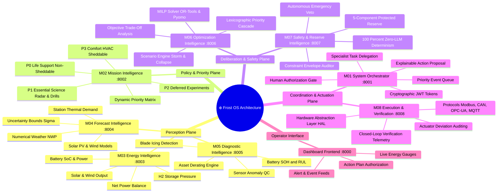

# ❄️ Frost OS: Architecture Mapping & Route Mindmap

> **Polar Microgrid Agentic AI Energy Operating System**  
> *Closed-Loop Perception, Optimization, Safety Auditing, and Hardware Execution for Polar Stations.*

---

## 1. High-Level Architecture Mindmap



---

## 2. Closed-Loop Event-to-Action Route Map

The diagram below traces the **exact lifecycle of an event** (e.g., a sudden solar irradiance collapse during a polar storm) across all 8 modules from detection to physical execution and closed-loop verification.

```mermaid
flowchart TD
    classDef perception fill:#1E293B,stroke:#38BDF8,stroke-width:2px,color:#fff;
    classDef priority fill:#1E293B,stroke:#F59E0B,stroke-width:2px,color:#fff;
    classDef solver fill:#1E293B,stroke:#8B5CF6,stroke-width:2px,color:#fff;
    classDef safety fill:#1E293B,stroke:#EF4444,stroke-width:2px,color:#fff;
    classDef orchestrator fill:#1E293B,stroke:#10B981,stroke-width:2px,color:#fff;
    classDef execution fill:#1E293B,stroke:#06B6D4,stroke-width:2px,color:#fff;
    classDef human fill:#312E81,stroke:#6366F1,stroke-width:2px,color:#fff;

    %% Telemetry & Sensing
    subgraph SENSING ["1. Perception & Telemetry Stream"]
        T1["M03: Battery SoC, PV, Wind, H2 Pressure"]:::perception
        T2["M04: 24h Forecast & Ambient Temp (-28°C)"]:::perception
        T3["M05: Asset Health & Icing Deratings"]:::perception
    end

    %% Event Ingestion
    E1["⚡ Physical Trigger: SOLAR_OUTPUT_DROP (-45 kW)"]
    E1 -->|POST /orchestrator/events| O1["M01 Orchestrator: Priority Ingestion Queue"]:::orchestrator

    %% Workflow Delegation
    O1 -->|Route 1: Query Demand| M2["M02: Query Mission Load Priorities (P0 - P3)"]:::priority
    O1 -->|Route 2: Query State| T1
    O1 -->|Route 3: Query Forecast| T2
    O1 -->|Route 4: Query Deratings| T3

    %% Optimization Request
    M2 & T1 & T2 & T3 -->|Context Aggregation| O2["M01 Context Builder"]:::orchestrator
    O2 -->|POST /optimizer/station/{id}/optimize| M6["M06: Optimization Intelligence"]:::solver

    subgraph OPTIMIZATION ["2. Mathematical Deliberation"]
        M6 --> M6A["MILP Mathematical Solver (OR-Tools)"]:::solver
        M6 --> M6B["Lexicographic Cascade: Shed P3 (-20kW) -> P2 (-5kW)"]:::solver
        M6 --> M6C["Candidate Plan Generation"]:::solver
    end

    %% Safety Audit Route
    M6C -->|POST /safety/audit| M7["M07: Safety & Reserve Auditor (Zero-LLM)"]:::safety

    subgraph SAFETY_GATE ["3. Safety Audit & Reserve Verification"]
        M7 --> S1{"Audit 5-Component Reserve: Available >= 980 kWh?"}:::safety
        S1 -- "VIOLATION (Unsafe)" --> REJECT["⛔ VETO: Force Emergency Inverter Shedding"]:::safety
        S1 -- "PASSED (Safe)" --> S2["Audit P0 Life Support: 100% Protected?"]:::safety
        S2 -- "APPROVED" --> APPROVE["✅ Safe Plan Certified"]:::safety
    end

    %% Orchestration Plan
    APPROVE -->|Return Certified Plan| O3["M01: Synthesize Explainable Action Plan"]:::orchestrator

    %% Decision Gate: Human vs Emergency
    O3 --> CHECK_EMERGENCY{"Is Severe Life-Threatening Emergency?"}:::orchestrator
    
    CHECK_EMERGENCY -- "YES" --> BYPASS["Autonomous Emergency Bypass Token Issued"]:::safety
    CHECK_EMERGENCY -- "NO" --> HUMAN_GATE["Operator Dashboard: Review Rationale & Metrics"]:::human

    HUMAN_GATE -->|POST /orchestrator/action-plans/{id}/authorize| SIGNED["M01: Cryptographic Action Token Issued (JWT/RSA)"]:::orchestrator
    BYPASS --> SIGNED

    %% Hardware Actuation
    SIGNED -->|POST /execution/commands/dispatch| M8["M08: Hardware Execution & Verification"]:::execution

    subgraph HARDWARE_EXEC ["4. Physical Actuation & Closed-Loop Feedback"]
        M8 --> HAL["Hardware Abstraction Layer (HAL)"]:::execution
        HAL --> PROTOCOLS["Industrial Protocols (Modbus TCP, CAN Bus, OPC-UA)"]:::execution
        PROTOCOLS --> PHYSICAL["Physical Relays, Inverters & Generators"]:::execution
        PHYSICAL -.->|Sensors Measure Real kW Change| SENS_FEEDBACK["Feedback Telemetry Readback"]:::execution
        SENS_FEEDBACK --> VERIFY{"Deviation < 5 kW?"}:::execution
        VERIFY -- "YES" --> SUCCESS["✅ Closed-Loop Execution Verified"]:::execution
        VERIFY -- "NO" --> RETRY["⚠️ Actuation Alarm & Fallback Relay Trip"]:::safety
    end
```

---

## 3. Module Interconnection & API Route Matrix

| Module | Service Name | Base Port | Key REST Endpoints | Asynchronous Redis Streams |
|---|---|---|---|---|
| **M01** | System Orchestrator | `8001` | `POST /orchestrator/events`<br>`GET /orchestrator/priority-queue`<br>`POST /orchestrator/action-plans/{id}/authorize` | `stream:station:events`<br>`stream:action:tokens` |
| **M02** | Mission Intelligence | `8002` | `GET /missions/processes/priority-state`<br>`POST /missions/ration-order`<br>`GET /missions/loads/p0-p3` | `stream:mission:updates` |
| **M03** | Energy Intelligence | `8003` | `GET /energy/telemetry/live`<br>`GET /energy/power-balance`<br>`GET /energy/storage/soc` | `stream:telemetry:raw`<br>`stream:power:balance` |
| **M04** | Forecast Intelligence | `8004` | `GET /forecast/weather/24h`<br>`GET /forecast/generation/renewables`<br>`GET /forecast/thermal/demand` | `stream:forecast:updates` |
| **M05** | Diagnostic Intelligence | `8005` | `GET /api/v1/equipment`<br>`GET /api/v1/health`<br>`GET /api/v1/anomalies/icing` | `stream:diagnostic:alerts` |
| **M06** | Optimization Intelligence | `8006` | `POST /optimizer/station/{id}/optimize`<br>`GET /optimization/priority-dispatch`<br>`POST /optimization/scenarios/run` | `stream:optimizer:plans` |
| **M07** | Safety & Reserve Intelligence | `8007` | `POST /safety/audit`<br>`GET /safety/status/{id}`<br>`GET /safety/rules` | `stream:safety:veto`<br>`stream:safety:emergency` |
| **M08** | Execution & Verification | `8008` | `POST /execution/commands/dispatch`<br>`GET /execution/verification/status/{id}`<br>`POST /execution/emergency-trip` | `stream:hardware:telemetry`<br>`stream:execution:audit` |

---

## 4. Priority Load Rationing Hierarchy (M02 & M06)

When renewable generation drops or a blizzard strikes, Frost OS follows a strict **Lexicographic Cascade**:

```
┌─────────────────────────────────────────────────────────────┐
│ 🔴 P0: LIFE SUPPORT & SURVIVAL (Non-Sheddable)              │
│ Habitat Heating, Oxygen Circulation, Base Medical Systems   │
│ Rule: NEVER shed under any circumstances.                   │
├─────────────────────────────────────────────────────────────┤
│ 🟠 P1: CRITICAL MISSION SCIENCE (Protected)                 │
│ Ice-Core Cryo-Freezers, Deep-Space Communication Antennas   │
│ Rule: Protected by 270 kWh dedicated reserve.              │
├─────────────────────────────────────────────────────────────┤
│ 🟡 P2: DEFERRED EXPERIMENTS (Sheddable Priority 2)          │
│ Ambient Radar Scanners, Atmospheric Spectrometers           │
│ Rule: Shed after P3 is exhausted to balance microgrid.      │
├─────────────────────────────────────────────────────────────┤
│ 🟢 P3: AUXILIARY COMFORT & HVAC (Sheddable Priority 1)       │
│ Exercise Room HVAC, Recreational Lights, Secondary Heaters  │
│ Rule: First loads shed automatically upon deficit.          │
└─────────────────────────────────────────────────────────────┘
```

---

## 5. The 5-Component Protected Reserve Formula (M07)

Module 07 audits energy buffers before approving any plan using this formula:

$$R_{\text{protected}} = R_{\text{continuity}} + R_{\text{emergency}} + R_{\text{mission}} + R_{\text{weather\_uncertainty}} + R_{\text{asset\_risk}}$$

1. **Station Continuity Reserve ($R_{\text{continuity}}$)**: Minimum power to run habitat survival through the longest forecast storm gap.
2. **Emergency Reserve ($R_{\text{emergency}}$)**: Black-start battery capacity reserved exclusively for fire suppression and emergency beacons.
3. **Mission Protected Reserve ($R_{\text{mission}}$)**: Power to keep P1 biological/ice samples frozen.
4. **Weather Uncertainty Margin ($R_{\text{weather\_uncertainty}}$)**: Statistical hedge ($\pm 3\sigma$) against wind collapse.
5. **Asset Risk Margin ($R_{\text{asset\_risk}}$)**: Extra buffer added when M05 detects blade icing or cell degradation.

---

## 6. Physical Hardware Interfaces (M08 HAL)

```
        M08 Execution & Verification Intelligence
                           │
       ┌───────────────────┼───────────────────┐
       ▼                   ▼                   ▼
  [Modbus TCP]         [CAN Bus]            [OPC-UA]
       │                   │                   │
  Inverters &         BMS & Battery       Gas Turbine &
  Solar Trackers      Cell Strings        Hydrogen Fuel Cells
```
- **Closed-Loop Actuation**: Every dispatched command (e.g. `SET_INVERTER_LIMIT 50kW`) requires telemetry verification within 5 seconds. If the physical sensor feedback does not match within $\pm 5\%$, M08 raises an actuation discrepancy alarm and falls back to hardwired safety interlocks.
